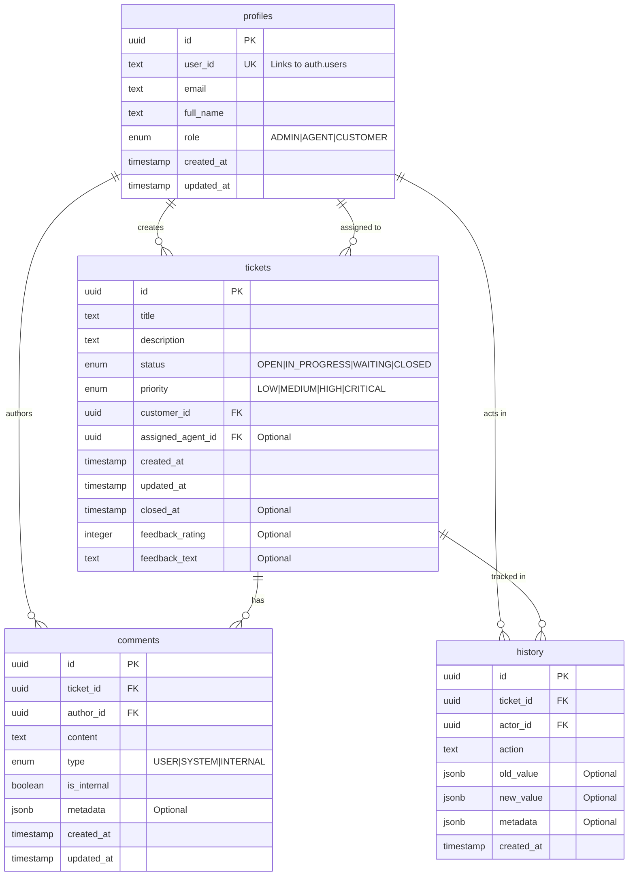

# Entity-Relationship Diagram

## Overview

This diagram shows the relationships between tables in the EmberOne database, including their fields and relationship types.

## Relationship Details

### One-to-Many Relationships

1. **profiles → tickets (as customer)**
   - A profile can create multiple tickets
   - Each ticket must have one customer
   - Relationship enforced by `customer_id` in tickets table

2. **profiles → tickets (as agent)**
   - A profile (agent) can be assigned to multiple tickets
   - Each ticket can have at most one assigned agent
   - Optional relationship through `assigned_agent_id`

3. **profiles → comments**
   - A profile can author multiple comments
   - Each comment has one author
   - Comments preserved with NULL author if profile deleted

4. **profiles → history**
   - A profile can be the actor in multiple history entries
   - Each history entry has one actor
   - History preserved when profile deleted

5. **tickets → comments**
   - A ticket can have multiple comments
   - Each comment belongs to one ticket
   - Comments deleted when ticket deleted (CASCADE)

6. **tickets → history**
   - A ticket can have multiple history entries
   - Each history entry belongs to one ticket
   - History preserved when ticket deleted

## Field Details

### Primary Keys
- All tables use UUID primary keys
- Keys are auto-generated using gen_random_uuid()

### Foreign Keys
- All foreign keys reference UUIDs from related tables
- Appropriate delete actions configured (CASCADE/SET NULL)

### Timestamps
- `created_at`: Set automatically on record creation
- `updated_at`: Updated automatically on record modification
- `closed_at`: Only for tickets, marks completion

### JSON Fields
- Used for flexible data storage
- Structured according to TypeScript interfaces
- Allows for schema evolution without migrations

## Indexes

### profiles
- Primary Key on `id`
- Unique Index on `user_id`

### tickets
- Primary Key on `id`
- Index on `customer_id`
- Index on `assigned_agent_id`
- Index on `status`
- Index on `priority`

### comments
- Primary Key on `id`
- Index on `ticket_id`
- Index on `author_id`
- Index on `created_at`

### history
- Primary Key on `id`
- Index on `ticket_id`
- Index on `actor_id`
- Index on `created_at` 